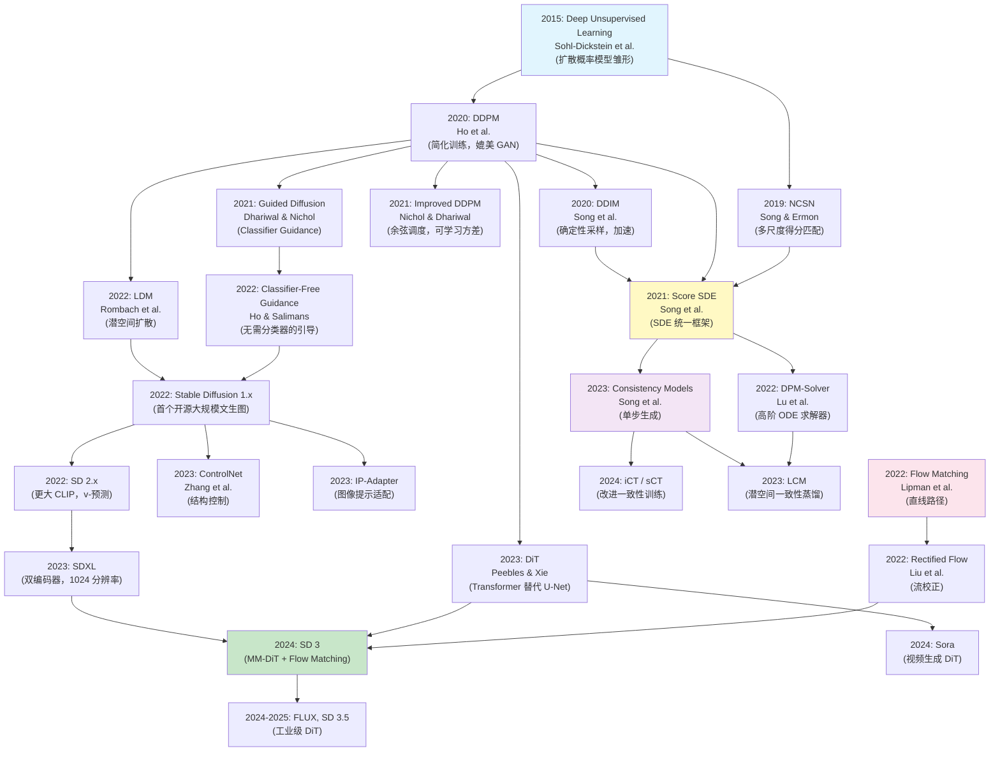

# 模型演化关系图

> 🔰 入门 | 本文提供扩散模型发展脉络的全局视图

## 技术演化全景



## 三条技术主线

### 主线一：模型架构演化

```
U-Net (DDPM, 2020)
  │
  ├─→ 条件 U-Net + 交叉注意力 (LDM, 2022)
  │     │
  │     ├─→ 更大 U-Net + 双编码器 (SDXL, 2023)
  │     │
  │     └─→ ControlNet 等控制模块 (2023)
  │
  └─→ DiT: Transformer 替代 U-Net (2023)
        │
        ├─→ MM-DiT: 多模态联合 Transformer (SD3, 2024)
        │
        └─→ Spacetime DiT: 视频生成 (Sora, 2024)
```

**趋势**：U-Net → DiT，Transformer 的 Scaling Laws 优势在扩散模型中同样成立。

### 主线二：训练框架演化

```
DDPM 损失 (ε-预测 + MSE, 2020)
  │
  ├─→ v-预测 (SD 2.x, 2022)
  │
  ├─→ Min-SNR 加权 (2023)
  │
  └─→ Flow Matching (直接速度场, 2022)
        │
        └─→ Rectified Flow (SD3, 2024)

Score Matching (NCSN, 2019)
  │
  └─→ SDE 统一框架 (Score SDE, 2021)
        │
        └─→ Consistency Models (2023)
```

**趋势**：从 DDPM 损失 → Flow Matching，训练目标越来越简洁。

### 主线三：采样加速演化

```
DDPM 1000 步 (2020)
  │
  ├─→ DDIM 50-100 步 (2020)
  │     │
  │     └─→ DPM-Solver 10-20 步 (2022)
  │
  ├─→ 蒸馏 4-8 步 (Progressive Distillation, 2022)
  │     │
  │     └─→ LCM 2-4 步 (2023)
  │
  └─→ Consistency Models 1-2 步 (2023)
        │
        └─→ iCT/sCT 1-2 步 (2024)
```

**趋势**：从 1000 步 → 1 步，采样效率提升了 3 个数量级。

## 关键里程碑时间线

| 时间 | 里程碑 | 影响 |
|------|--------|------|
| 2020.06 | DDPM | 证明扩散模型可以媲美 GAN |
| 2020.10 | DDIM | 10-20× 加速，确定性采样 |
| 2021.05 | Guided Diffusion | 首次在 ImageNet 上超越 GAN |
| 2021.11 | Score SDE | 统一理论框架 |
| 2022.04 | DALL·E 2 | 首个商业级文生图产品 |
| 2022.08 | Stable Diffusion 1.x | 开源引爆社区 |
| 2022.12 | LDM / Latent Diffusion | 潜空间扩散成为标准 |
| 2023.02 | ControlNet | 精细结构控制 |
| 2023.03 | Consistency Models | 单步生成成为可能 |
| 2023.07 | SDXL | 商业级开源 1024 分辨率 |
| 2024.02 | Sora | 视频生成 DiT，刷新认知 |
| 2024.03 | SD3 | MM-DiT + Flow Matching 范式转换 |

## 如何选择模型

| 场景 | 推荐方案 | 理由 |
|------|---------|------|
| 文生图入门 | Stable Diffusion 1.5/XL | 生态最完善 |
| 最高图像质量 | SD3 / FLUX | 最新架构 |
| 实时生成 | LCM / SDXL-Turbo | 2-4 步高质量 |
| 精细控制 | SD + ControlNet | 最灵活的控制 |
| 研究/理解原理 | DDPM | 最简洁，便于学习 |
| 自定义训练 | DiT + Flow Matching | 最新范式，Scaling 好 |

---

> **下一篇**：[条件生成概述](../03-conditional-generation/01-overview.md) — 进入模块三，学习如何控制扩散模型的生成内容。
