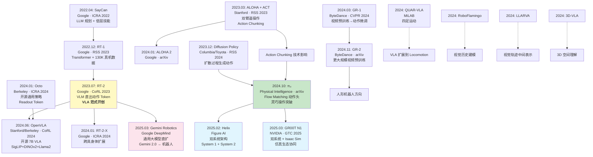

# VLA 模型演化关系图

> 🔰 入门 → ⚙️ 进阶 | 本文提供 VLA 技术发展脉络的全局视图

## 技术演化全景



## 关键里程碑时间线（带发表会议）

| 时间 | 里程碑 | 会议/发布 | 机构 | 核心贡献 | 影响 |
|------|--------|----------|------|---------|------|
| 2022.04 | SayCan | ICRA 2022 (Oral) | Google | LLM+机器人结合的开创性验证 | 证明 LLM 常识可用于机器人规划 |
| 2022.12 | RT-1 | RSS 2023 | Google | 大规模真机数据 + Transformer | 130K 轨迹数据规模标杆 |
| 2023.03 | ALOHA + ACT | RSS 2023 | Stanford | 低成本双臂 + Action Chunking | 开创 Action Chunking 范式 |
| 2023.07 | **RT-2** | **CoRL 2023** | **Google** | **VLM 直出动作 Token** | **VLA 范式开创，涌现能力验证** |
| 2023.12 | Diffusion Policy | RSS 2024 | Columbia/TRI | 扩散模型生成动作 | 证明扩散适合多模态动作分布 |
| 2024.01 | Octo | ICRA 2024 | Berkeley | 开源跨机器人基础模型 | 第一个开源通用策略 |
| 2024.01 | RT-2-X | ICRA 2024 | Google | 多机器人联合训练 | Open X-Embodiment 数据集 |
| 2024.03 | GR-1 | CVPR 2024 | ByteDance | 视频预训练→人形控制 | 视频预训练路线验证 |
| 2024.06 | OpenVLA | CoRL 2024 | Stanford/Berkeley | 开源 7B VLA 基线 | 社区标准基线 |
| 2024.10 | **π₀** | **arXiv (审稿中)** | **Physical Intelligence** | **Flow Matching + 灵巧操作** | **VLA 性能新标杆** |
| 2024.11 | GR-2 | arXiv | ByteDance | 更大规模视频预训练 | 视频预训练扩展性验证 |
| 2025.02 | **Helix** | **公司发布** | **Figure AI** | **双系统人形 VLA** | **工业部署（BMW 工厂）** |
| 2025.03 | **GR00T N1** | **GTC 2025** | **NVIDIA** | **双系统 + 仿真生态** | **全栈生态闭环** |
| 2025.03 | **Gemini Robotics** | **公司发布** | **Google DeepMind** | **通用大模型→机器人** | **路线之争白热化** |

## 三条技术主线

### 主线一：动作表示演化

```
离散 Token (RT-2, 2023.07)
  │  优点: 复用 LLM 自回归，架构最简
  │  缺点: 量化精度损失，单峰预测
  │
  ├─→ 离散 Token + 开源 (OpenVLA, 2024.06)
  │     256 bin 量化，社区可复现
  │
  └─→ 连续动作生成
        │
        ├─→ MLP 回归 (Octo, 2024.01)
        │     优点: 简单快速
        │     缺点: 仍然单峰
        │
        ├─→ Diffusion Policy (2023.12)
        │     优点: 多模态分布建模
        │     缺点: 多步去噪较慢
        │
        └─→ Flow Matching (π₀, 2024.10) ← 当前最优
              优点: 比 Diffusion 更快收敛，训练更稳定
              π₀ 实现 50 Hz 等效控制频率

技术趋势: 离散→连续，单峰→多模态，慢→快
```

### 主线二：架构演化

```
单系统 VLM (RT-2, OpenVLA)
  │  一个 VLM 负责一切: 理解+决策+动作
  │  优点: 架构简单，端到端
  │  缺点: 频率受限于 VLM 推理速度
  │
  ├─→ VLM + 独立解码头 (π₀, 2024.10)
  │     VLM 负责理解，独立头负责动作生成
  │     解耦了推理和动作生成
  │
  └─→ 双系统架构 (Helix, GR00T N1, 2025)
        │
        ├─→ System 1: 快速运动控制 (30-200 Hz)
        │     MLP/DiT，低延迟，负责平衡+执行
        │
        └─→ System 2: 慢速 VLM 推理 (1-5 Hz)
              大型 VLM，高智能，负责理解+规划

技术趋势: 从"一个模型做一切"到"分工协作"
```

### 主线三：数据/预训练演化

```
真机数据为主 (RT-1, 130K 轨迹)
  │  优点: 真实无域间隙
  │  缺点: 采集昂贵、慢、有限
  │
  ├─→ 互联网图文 + 真机 Co-fine-tuning (RT-2, 2023.07)
  │     核心创新: 互联网知识迁移到机器人
  │
  ├─→ 跨机器人数据集 (Open X-Embodiment, 2024)
  │     │  100万+ 轨迹, 22 种机器人, 160K 任务
  │     ├─→ Octo, OpenVLA (多机器人预训练)
  │     └─→ π₀ (7+ 种具身体联合训练)
  │
  ├─→ 视频预训练 (GR 系列, 2024)
  │     互联网视频包含丰富的物理世界知识
  │     视频预测→动作微调的两阶段范式
  │
  └─→ 仿真大规模预训练 (GR00T N1 + Isaac Sim, 2025)
        1024+ 并行环境, 100M+ 仿真轨迹
        域随机化 + 少量真机微调弥合 Sim-to-Real gap

技术趋势: 数据规模指数增长，来源多样化
```

## 技术谱系图：谁构建在谁的基础上

```
代码/数据继承关系:

Google 系:
  RT-1 数据集 ──→ RT-2 训练 ──→ Gemini Robotics 延续
  PaLI-X/PaLM-E ──→ RT-2 基座 ──→ Gemini 2.0 基座
  Open X-Embodiment 数据 ──→ Octo / OpenVLA 训练

Stanford/Berkeley 系:
  ALOHA 硬件 + ACT ──→ π₀ 受 Action Chunking 启发
  Octo 代码框架 ──→ OpenVLA 部分参考
  Open X-Embodiment (Berkeley 主导) ──→ 社区共享

PaliGemma 系:
  PaliGemma (Google) ──→ π₀ 基座 VLM
  SigLIP (Google) ──→ OpenVLA 视觉编码器

Diffusion 系:
  DDPM/Score Matching ──→ Diffusion Policy ──→ π₀ Flow Matching
                                             ──→ GR00T N1 Diffusion Transformer

视频预训练系:
  VideoMAE/TimeSformer ──→ GR-1 视频预训练 ──→ GR-2 扩展
```

## 学术 vs 工业路线

| 路线 | 代表 | 特点 | 融资/资源 | 数据规模 | 计算规模 |
|------|------|------|----------|---------|---------|
| **学术开源** | Octo, OpenVLA, Diffusion Policy | 开源可复现、社区驱动 | 学术经费 | 100K-1M 轨迹 | 数十 GPU 小时 |
| **工业半开源** | π₀ | 部分开源、性能领先 | $70M+ (Physical Intelligence) | 数百万轨迹 | 数百 GPU 小时 |
| **工业闭源（纯机器人）** | Helix | 闭源、垂直整合、商业化 | $700M+ (Figure AI, 估值 >$7B) | 未公开 | 大规模 |
| **工业闭源（平台型）** | GR00T N1 | 闭源、生态平台 | NVIDIA 内部投入 (数十亿级) | 仿真 100M+ | GPU 集群 |
| **工业闭源（大模型型）** | Gemini Robotics | 闭源、通用大模型路线 | Google DeepMind (数十亿级) | 互联网+真机 | TPU 集群 |

### 投资与商业化背景

VLA 赛道在 2024-2025 年吸引了大量资本：

```
融资规模 (估计):

Figure AI:     ~$750M+ (Bezos, Microsoft, NVIDIA, OpenAI)
Physical Intelligence: ~$400M+ (Khosla Ventures, Thrive)
1X Technologies: ~$100M+ (OpenAI Fund)
Covariant:     ~$200M+
Skild AI:      ~$300M+
                              Total: 数十亿美元级

资本驱动力:
  → 人形机器人被视为 AI 的"下一个 iPhone"
  → 大模型能力突破使通用机器人成为可能
  → 劳动力短缺的长期趋势
```

## 开放问题与未来方向

### 路线收敛还是分化？

```
当前的三条路线最终会收敛吗？

路线 A: 专用 VLA (π₀, OpenVLA)
路线 B: 双系统 (Helix, GR00T N1)
路线 C: 通用大模型 (Gemini Robotics)

可能的收敛形态:
  → 通用大模型 (路线C) 作为 System 2
  → 专用动作头 (路线A) 作为 System 1
  → 形成"大模型推理 + 专用执行"的统一架构
  → 本质上就是 路线B 的一种实现

开放问题:
  1. 多大的模型才"足够"用于机器人推理？
  2. 仿真数据能否完全替代真机数据？
  3. 通用基础模型 vs 任务特化模型的最终平衡点在哪？
  4. 开源社区能否跟上工业闭源的速度？
```

### 关键技术缺口

| 缺口 | 现状 | 需要突破 |
|------|------|---------|
| **长程任务** | 大多数 VLA 只能完成 30 秒以内的任务 | 需要持续推理和错误恢复 |
| **安全保障** | 仅 Gemini Robotics 有初步安全推理 | 需要形式化安全验证 |
| **泛化鲁棒性** | 实验室成功率高，真实环境下降显著 | 需要更好的域泛化方法 |
| **多机器人协作** | 几乎所有工作都是单机器人 | 需要多智能体协调 |
| **持续学习** | 部署后不能从新经验中学习 | 需要在线适应能力 |

## 小结

| 维度 | 要点 |
|------|------|
| **范式开创** | RT-2 (2023.07) 开创 VLA 范式，证明互联网知识→机器人迁移 |
| **三条主线** | 动作表示（离散→连续）、架构（单系统→双系统）、数据（真机→仿真+互联网） |
| **技术谱系** | Google RT 系 / Stanford-Berkeley 开源系 / 工业闭源系 |
| **资本驱动** | 2024-2025 数十亿美元涌入，人形机器人成为 AI 最热赛道 |
| **开放问题** | 路线是否收敛、模型规模极限、安全保障、长程任务 |

---

> **下一篇**：[大规模机器人数据集](../04-training/01-datasets.md) — 进入模块四：VLA 训练技术。
